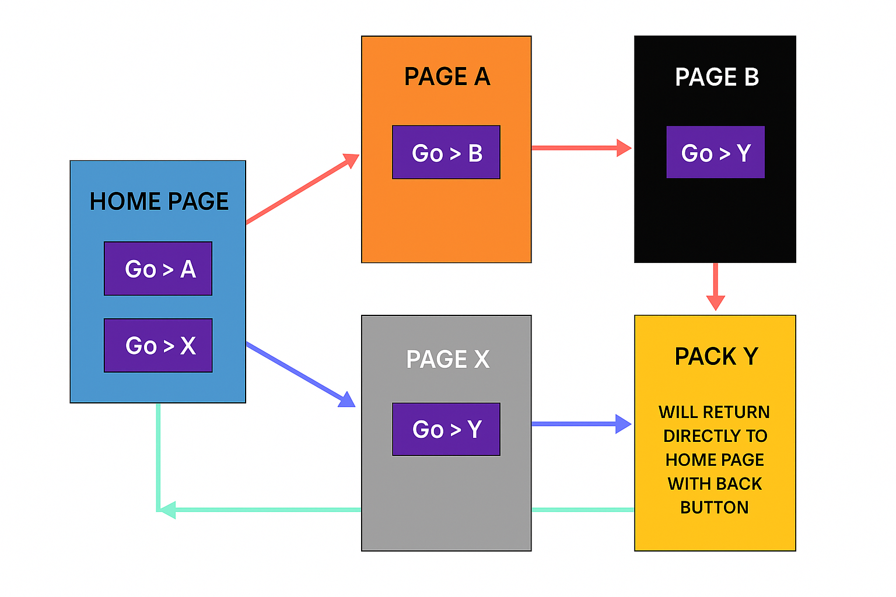

# Flutter Navigation Flow Example

This Flutter project demonstrates a structured navigation system between multiple pages, including:

- Navigating between five distinct pages
- Custom back button behavior
- Return to the home page directly from a deep screen
- A visual representation of the flow

---

## 📱 Pages Overview

- **HOME PAGE**
  - Go to **Page A**
  - Go to **Page X**
- **Page A** → Page B
- **Page B** → Page Y
- **Page X** → Page Y
- **Page Y**
  - Pressing the back button will return directly to **Home Page**

---

## 🧭 Navigation Flow Diagram

Below is the diagram showing how users move through the app:



> Make sure to save the diagram above as `assets/navigation_flow.png` in your project directory.

---

## 🚀 Getting Started

Clone this repository and run the Flutter project:

```bash
git clone https://github.com/yourusername/flutter-navigation-flow-example.git
cd flutter-navigation-flow-example
flutter pub get
flutter run


## Getting Started

This project is a starting point for a Flutter application.

A few resources to get you started if this is your first Flutter project:

- [Lab: Write your first Flutter app](https://docs.flutter.dev/get-started/codelab)
- [Cookbook: Useful Flutter samples](https://docs.flutter.dev/cookbook)

For help getting started with Flutter development, view the
[online documentation](https://docs.flutter.dev/), which offers tutorials,
samples, guidance on mobile development, and a full API reference.
